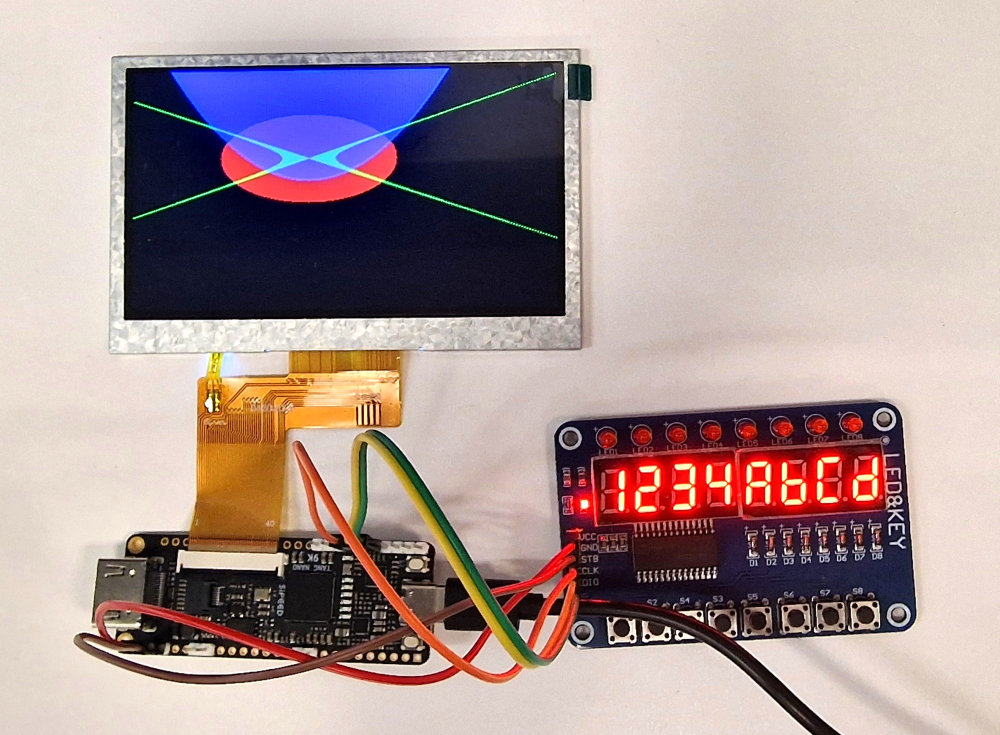

## Verilog Hackathon Education Kit Manual

---

# Agenda

### Part 1: Foundations

**1. Why Verilog?**
<!-- .element: class="fragment" data-fragment-index="1" -->

---

# Foundation

This Manual and labs are a comprehensive introduction to Verilog Hardware Description Language (HDL), designed for
both beginners and experienced engineers looking to deepen their understanding of digital system design. 
Whether you're new to Verilog or aiming to strengthen your skills, this course offers a solid foundation in 
modeling, simulating, and synthesizing digital logic. 
<!-- .element: class="fragment" data-fragment-index="1" -->

---

You’ll learn how to describe complex hardware systems using Verilog, with hands-on experience targeting both 
FPGA and ASIC platforms.
<!-- .element: class="fragment" data-fragment-index="1" -->

Through progressive modules, real-world labs, and capstone projects, you'll gain practical skills applicable 
to embedded systems, electronics engineering, and chip design industries. This course balances conceptual 
understanding with industry-relevant application, making it ideal for students, hobbyists, and professionals alike.
<!-- .element: class="fragment" data-fragment-index="2" -->

---

This Verilog Manual will walk you through a set of Labs and Exercises that will quickly let you see the results 
of your Verilog code implemented in hardware.  You will learn through hands-on-labs that will take you from simple
Verilog syntax to more complex structures. 
<!-- .element: class="fragment" data-fragment-index="1" -->

The Lessons will explain the code, and the Labs will provide challenges 
implementing the concepts from the Lessons. This Tutorial will not go very deep into Simulation or Testbenches.
The goal is to teach basic Verilog syntax, and quickly see its implementation in the kit Hardware.
<!-- .element: class="fragment" data-fragment-index="2" -->

While the Verilog design flows described in this Manual can target multiple FPGAs boards & ASIC tools flows, 
most design flows described in this manual,  will target the Gowin Sipeed Tang Nano 9K FPGA Development Board 
(GOWIN GW1NR-9)  
<!-- .element: class="fragment" data-fragment-index="3" -->

---

# Why Verilog?

Digital circuits primarily consist of interconnected transistors. We analyze these circuits with the aid of
hierarchical structure. 
<!-- .element: class="fragment" data-fragment-index="1" -->

Hierarchical structure allow us to represent a digital circuit by means of interconnected diagrams called Schematic.
<!-- .element: class="fragment" data-fragment-index="2" -->

But as the complexity of the circuit increases every two years according to Moore's law, schematic's intuitiveness 
becomes  a liability, so Hardware description Language like Verilog, SystemVerilog and VHDL came into picture.
<!-- .element: class="fragment" data-fragment-index="3" -->

---

# RTL Design

HDLs model the digital circuits in as RTL. Register Transfer refers to how the language describes the 
data flow between register and how to apply logical operations on the data.
<!-- .element: class="fragment" data-fragment-index="1" -->

In RTL design, register is a hardware element that can store a fixed amount of data. Registers store the data in
the form of binary digits or bits.
<!-- .element: class="fragment" data-fragment-index="2" -->

And the number of bits a register can store is called the width of the register. 
<!-- .element: class="fragment" data-fragment-index="3" -->

---

# Sample Verilog Module

<pre><code data-trim class="language-verilog">
module and_gate ( 
    input wire a, 
    input wire b, 
    output wire y 
); 
    assign y = a & b; 
end module
</code></pre>
<!-- .element: class="fragment" data-fragment-index="1" -->

In the above module there are two input signals *a* and *b* and they are assigned to output *y*.
<!-- .element: class="fragment" data-fragment-index="2" -->

The above module is called *Combinational Block*
<!-- .element: class="fragment" data-fragment-index="3" -->

---

# Combinational Circuits

Combinational circuit is a type of digital logic where the output is dependent only on the present input.
<!-- .element: class="fragment" data-fragment-index="1" -->

<pre><code data-trim class="language-verilog">
assign y = a & b; 
</code></pre>
<!-- .element: class="fragment" data-fragment-index="2" -->

assign is one of the combinational construct in SystemVerilog where it continuously assign the output
y with AND of inputs a and 
b
<!-- .element: class="fragment" data-fragment-index="3" -->

---

# Uses of Combinational Circuits

Most common uses of combination logic is Multiplexers. It can also be used for creating Arithmetic and logic
blocks like Adders, Subtractors and Comparators.
<!-- .element: class="fragment" data-fragment-index="1" -->

---

### Implementing Mux in SystemVerilog

<pre><code data-trim class="language-verilog">
module mux_2_1
(
  input  [3:0] d0, d1,
  input        sel,
  output [3:0] y
);

  assign y = sel ? d1 : d0;

endmodule
</code></pre>
<!-- .element: class="fragment" data-fragment-index="1" -->

The above module uses 4-bit input and output registers. It uses a 1-bit select line which can have value 0 or 1.
<!-- .element: class="fragment" data-fragment-index="2" -->

When the select is 0, output y is assigned with the input d0, and when the select is 1 the output y is assigned with input d1.
<!-- .element: class="fragment" data-fragment-index="3" -->

---

### Ways to implement Mux in SystemVerilog

<pre><code data-trim class="language-verilog">
  always_comb
    if (sel)
      y = d1;
    else
      y = d0;
</code></pre>
<!-- .element: class="fragment" data-fragment-index="1" -->

---

